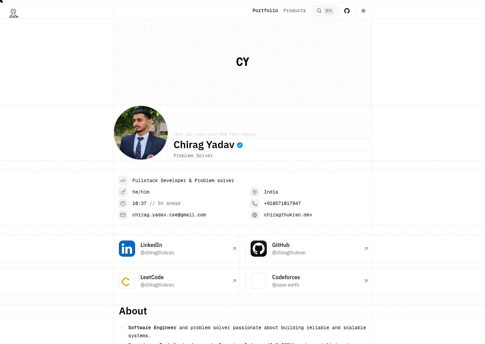

# Vwebit — Website & SEO Agency for Indian SMEs 🚀

> **We Help Indian Businesses Win Online.**  
> Vwebit is a website development and digital marketing agency based in Jalandhar, Punjab, dedicated to helping small and medium-sized businesses (SMEs) across India get more customers through professional websites, local SEO, and Google Business Profile optimization.

---

## 🏢 About the Business
Most web agencies build websites for companies with huge marketing budgets. Small businesses—like packers and movers, local clinics, or contractors—are often left with generic templates, slow sites, and zero search visibility. 

We started **Vwebit** to fix that. We build professional, blazing-fast, and SEO-optimized websites specifically tailored for Indian SMEs at prices that make sense (starting at just **₹7,999**). 

Our mission is simple: when a customer searches for your services in your city, **you** should appear—not just your bigger competitors.

## 🛠️ Core Services
- **Website Development:** Fast, responsive, and beautifully designed websites optimized for lead generation.
- **Local SEO:** Targeted local search optimization to dominate your city's search results.
- **Google Business Profile (GMB):** Setup, verification, and ranking optimization for the Google Map Pack.
- **Business Automation:** WhatsApp integration, CRM setups, and automated lead follow-ups.

## 🎯 Target Industries
We specialize in creating digital growth engines for:
- 📦 **Packers & Movers**
- 🚛 **Transport & Logistics**
- 🏥 **Clinics & Healthcare**
- 🏗️ **Contractors & Builders**
- 🏪 **Retail & Local Shops**

## 💡 Our Values
1. **Results First:** We measure our success by the leads and enquiries we generate for you, not just by how good the website looks.
2. **Built for Indian SMEs:** We understand the reality of running a small business in India. Our pricing, communication, and approach reflect that.
3. **SEO at the Core:** SEO is never an add-on. Every decision—from site structure to content—is made with search visibility in mind.
4. **Local Market Knowledge:** We know how Indian customers search, what builds trust, and what drives actual business enquiries.

---

### 🌐 Contact & Links
- **Website:** [www.vwebit.xyz](https://www.vwebit.xyz)
- **Location:** Jalandhar, Punjab (Serving clients pan-India)
- **Developer & Founder:** [Chirag Thukran](https://chiragthukran.dev)

*Built with Next.js, Tailwind CSS, and optimized for maximum speed and conversion.*
